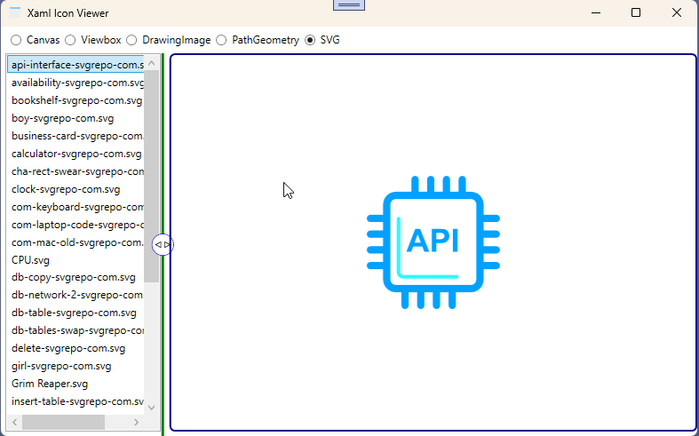
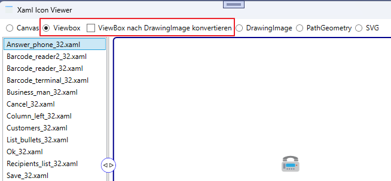
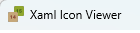

# Xaml Icon Viewer und Konverter


]

Das Projekt soll den Umgang mit den verschiedenen Vektor Typen zeigen. Der Fokus liegt auf dem Lesen von Vektor Inhalten aus einer XAML Resources Datei sowie dem Konverteiren nach Bitmap (RenderTargetBitmap).<br/>
In dem Beispiel werden folgende Vektor-Typen behandelt.</br>
- Canvas
- DrawingImage
- PathGeometry
- Viewbox
- Konverter Viewbox nach DrawingImage
  (auf Ebene der Xaml-Datei)
- SVG (Vektor Grafik)

Vektorgrafiken haben unter WPF eine große Bedeutung. Durch die Skalierbarkeit können diese ohne Probleme an verschiedenen Grafik-Auflösungen *z.B. 4K  Monitore* angepasst werden. Gerade unter Windows 10/11 hat dies einen großen Vorteil, da Windows selbst Grafiken mit Vektoren verwendet.</br>
Ein weiterer Vorteil ist auch, das Vektorgrafiken über verschiedene Webseiten mit einer freien Lizenz angeboten werden.

[Pictogrammers](https://pictogrammers.com/library/mdi/)</br>
[Material Design Icons](https://petershaggynoble.github.io/MDI-Sandbox/)</br>

Ein weiterer Punkt ist, das die verschiedenen Vektortypen in einer gemeinsamen Resources-datei zusammen gefasst werden können. Auch die Größe der einzelnen Grafiken können bei einer großen Anzahl von Icon (als png, ico, usw.) eine Rolle spielen.</>



Die Verschiedenen Beispiele der Vektorgrafiken liegen unter **\XamlIcon\...** und dem Namen des jeweiligen Typ.

Beispiel **Canvas**
```xml
<Viewbox
    xmlns="http://schemas.microsoft.com/winfx/2006/xaml/presentation"
    xmlns:x="http://schemas.microsoft.com/winfx/2006/xaml"
    x:Name="Customers_32"
    Width="32"
    Height="32">
    <Viewbox.Clip>
        <RectangleGeometry Rect="0,0,32,32" />
    </Viewbox.Clip>
    <Canvas
        Width="256"
        Height="256"
        HorizontalAlignment="Center"
        VerticalAlignment="Center"
        Background="#00FFFFFF">
        <Viewbox
            Canvas.Left="10.274"
            Canvas.Top="30.4695"
            Width="235.452"
            Height="195.061"
            Clip="{x:Null}">
            <Canvas Width="235.452" Height="195.061">
                <Canvas>
                    <Canvas>
                        <Canvas>
                            <Canvas>
                                <Path Data="M122.27,98.288C126.348,99.602 130.665,100.995 134.822,102.897 135.269,101.928 135.945,101.112 136.757,100.411 134.577,99.943 133.435,99.547 132.586,98.858 129.306,96.187 131.245,90.737 132.987,86.869 133.729,85.223 135.74,82.766 138.302,80.214 136.889,80.723 135.455,81.219 133.994,81.711 126.364,84.277 118.472,86.931 113.447,93.66 113.158,94.047 112.892,94.454 112.614,94.851 115.431,96.056 118.546,97.088 122.27,98.288z" Fill="#FF6A8E23" />
                                <Path Data="M162.609,162.876C162.554,163.576 162.497,164.276 162.425,164.977 162.852,164.988 163.267,165.002 163.699,165.012 163.359,164.35 162.994,163.633 162.609,162.876z" Fill="#FF000000" />
                            </Canvas>
                            <Path Data="F1M153.126,96.583C151.455,83.302 152.615,73.719 152.615,73.719 146.486,76.584 137.463,85.227 136.03,88.411 134.595,91.595 133.529,95.116 134.638,96.019 135.99,97.118 146.204,98.047 146.204,99.132 146.204,100.003 139.253,101.642 137.879,104.422 142.047,106.666 145.944,109.56 149.133,113.588 158.061,124.859 162.802,139.713 162.882,155.843 164.708,159.477 166.291,162.598 167.447,164.827L168.73,164.827C164.078,150.707,154.591,108.214,153.126,96.583z" Fill="#FF6A8E23" />
                            <Path Data="M224.765,93.661C219.741,86.935 215.033,84.238 207.404,81.63 205.88,81.11 204.388,80.585 202.917,80.045 205.56,82.657 207.645,85.186 208.404,86.869 210.146,90.737 212.083,96.187 208.803,98.858 207.956,99.547 206.814,99.943 204.632,100.411 205.7,101.331 206.54,102.448 206.92,103.855 207.377,105.539 207.055,107.315 206.017,108.853 204.924,110.507 196.797,126.822 190.269,139.933 185.312,149.882 180.614,159.317 177.695,165.006 214.884,164.197 231.798,156.783 234.228,142.918 237.529,124.084 234.08,106.13 224.765,93.661z" Fill="#FF6A8E23" />
                            <Path Data="F1M206.751,96.019C207.861,95.116 206.795,91.595 205.361,88.411 203.925,85.227 194.904,76.584 188.775,73.719 188.775,73.719 189.937,83.302 188.264,96.583 186.799,108.214 177.314,150.707 172.659,164.827L173.944,164.827C180.621,151.965 201.286,109.711 203.272,106.774 206.142,102.527 195.187,100.226 195.187,99.132 195.187,98.047 205.4,97.118 206.751,96.019z" Fill="#FF6A8E23" />
                            <Path Data="F1M197.93,30.242C197.93,9.869 185.325,0 169.776,0 154.226,0 141.621,9.869 141.621,30.242 141.621,44.111 147.466,59.027 156.1,67.142L156.1,75.868C161.875,81.065 168.122,82.619 170.521,83.04 172.996,82.605 179.561,80.972 185.48,75.375L185.48,65.063C192.992,56.641,197.93,42.996,197.93,30.242z" Fill="#FFE1A468" />
                        </Canvas>
                        <Canvas>
                            <Path Data="F1M107.806,41.843C107.806,19.698 94.104,8.972 77.203,8.972 60.302,8.972 46.6,19.698 46.6,41.843 46.6,56.918 52.953,73.132 62.338,81.952L62.338,91.438C68.615,97.086 75.404,98.775 78.013,99.233 80.703,98.76 87.839,96.986 94.273,90.901L94.273,79.692C102.437,70.538,107.806,55.707,107.806,41.843z" Fill="#FFE1A468" />
                            <Path Data="F1M85.147,117.371C86.059,115.014 88.317,112.814 90.562,110.797 90.562,110.797 86.533,101.569 78.013,101.569 69.493,101.569 65.465,110.797 65.465,110.797 67.71,112.814 69.968,115.014 70.877,117.371 74.19,125.957 69.991,136.641 67.87,147.993 65.166,162.462 69.493,195.061 69.493,195.061L86.533,195.061C86.533,195.061 90.861,162.462 88.156,147.993 86.035,136.641 81.835,125.957 85.147,117.371z" Fill="#FFE6624C" />
                            <Path Data="M63.021,152.568L46.938,100.948C43.494,102.47 39.736,103.68 35.868,104.908 27.106,107.683 18.045,110.559 12.273,117.847 1.576,131.349 -2.385,150.793 1.405,171.193 4.13,185.857 25.055,193.672 65.194,194.993 64.656,190.769 61.843,167.559 63.021,152.568z" Fill="#FF637984" />
                            <Path Data="M143.754,117.849C137.983,110.563 128.925,107.644 120.166,104.821 116.31,103.579 112.564,102.355 109.126,100.822L93.005,152.57C94.183,167.548 91.374,190.736 90.832,194.98 130.478,193.614 151.936,185.637 154.62,171.193 158.41,150.793 154.451,131.353 143.754,117.849z" Fill="#FF637984" />
                        </Canvas>
                    </Canvas>
                </Canvas>
            </Canvas>
        </Viewbox>
    </Canvas>
</Viewbox>
```

Vektorgrafiken als *SVG* Dateien werden ähnlich wie *DrawingImage* behandelt, und diese können auf Grund ihrer inneren Struktur beliebig komplex werden.</br>

**Hinweis**: Einige Vektortypen wie *Canvas* und *Viewbox* werden im XAML-Editor direkt dargestellt. Andere wie *PathGeometry* und *DrawingImage* nicht.

Der Aufbau in der Beispielanwendung ist für alle Typen im Grundsatz gleich.

1. Lesen der Dateien pro Typ.
2. Übernehmen der gefunden Typen in ein Dictionary<string,Vektor-Typ>
3. Konvertieren in den jeweilingen Vektor-Typ
4. Konvertieren in ein Bitmap (RenderTargetBitmap)

Das Konvertiern ist für alle Type relativ ähnlich, der Typ *DrawingImage* weicht hiervon etwas ab, da hier weitere Varianten wie *DrawingGroup* oder *GeometryDrawing* gibt.</br>
So ist es nun möglich, jeden der Vektortypen in ein Bitmap zu konvertieren.

# Konverter Viewbox nach DrawingImage

In der Klasse *ViewboxToDrawingImageXamlConverter* sind zwei Varianten implementiert
- ConvertViewboxXamlToDrawingImageXaml</br>
  Hier wird die ViewBox als Xaml geladen und die Vektoren für das DrawingImage neu zusammengestellt. Allerdings erzeugt diese Methode sehr große XAML-Dateien, und ein verwaschenes Bild. Daher keine gute Lösung. Eventuell findet jemand das Problem.
- CreateDrawingImageXamlFromViewboxXaml</br>
  Hier wird die XAML-Datei direkt als *ViewBox** gelesen, und als *DrawingImage* XAML-Datei wieder geschrieben.
- ConvertViewboxXamlToDrawingImageXaml</br>
- ConvertViewboxXamlToDrawingImageXaml</br>
  In dieser Variante sind die Probleme der direkten konvertierung nicht vorhanden. Die Dateien sind klein und die Darstellung zwischen **ViewBox** und **DrawingImage** gleich.



Bei der Auswahl von **ViewBox** kann einen Haken in der CheckBox gesetzt werden, dann wird jedes Icon, konvertiert und ein den Ordner **\XamlIcon\DrawingImage** als **OutVB_** gespeichert.

# Window.Icon aus DrawingImage erzeugen

```csharp
DrawingImage icon = (DrawingImage)FindResource("AppIcon2");
WpfIconHelper.ApplyIcon(this, icon, 32);
```

```xml
<DrawingImage x:Key="AppIcon2">
    <DrawingImage.Drawing>
        <DrawingGroup>
            <GeometryDrawing Brush="#FF8FA62D" Geometry="F1M206.896,141.875L108.189,141.875C96.288,141.875,86.604,132.193,86.604,120.291L86.604,21.585C86.604,9.683,96.288,0,108.189,0L206.896,0C218.798,0,228.48,9.683,228.48,21.585L228.48,120.291C228.48,132.193,218.798,141.875,206.896,141.875z" />
            <GeometryDrawing Brush="#FF47641B" Geometry="F1M117.814,53.988C118.873,54.08 119.795,54.126 120.578,54.126 123.48,54.126 125.703,53.515 127.246,52.294 128.789,51.074 129.964,48.978 130.771,46.007L141.584,46.007 141.584,94.894 129.285,94.894 129.285,63.49 117.814,63.49 117.814,53.988z" />
            <GeometryDrawing Brush="#FF47641B" Geometry="F1M169.221,78.919C169.52,80.945 170.32,82.563 171.622,83.772 172.923,84.982 174.507,85.587 176.372,85.587 178.469,85.587 180.196,84.919 181.555,83.583 182.914,82.247 183.594,80.531 183.594,78.435 183.594,76.454 182.942,74.755 181.642,73.339 180.34,71.922 178.733,71.214 176.821,71.214 174.196,71.214 172.054,72.204 170.396,74.186L159.581,74.186 162.414,46.027 193.89,46.027 192.818,56.288 171.639,56.288 170.81,64.131C174.011,62.081 176.982,61.057 179.724,61.057 184.376,61.057 188.234,62.623 191.298,65.755 194.361,68.888 195.894,72.803 195.894,77.502 195.894,82.892 194.016,87.297 190.262,90.717 186.507,94.138 181.751,95.848 175.992,95.848 170.718,95.848 166.422,94.42 163.105,91.563 159.788,88.708 157.935,84.804 157.543,79.852L169.221,78.919z" />
            <GeometryDrawing Brush="#FFC5A77A" Geometry="F1M120.292,226.895L21.585,226.895C9.684,226.895,0,217.213,0,205.311L0,106.605C0,94.704,9.684,85.021,21.585,85.021L120.292,85.021C132.193,85.021,141.876,94.704,141.876,106.605L141.876,205.311C141.876,217.213,132.193,226.895,120.292,226.895z" />
            <GeometryDrawing Brush="#FF884634" Geometry="F1M31.21,139.008C32.269,139.1 33.19,139.147 33.974,139.147 36.876,139.147 39.099,138.536 40.642,137.315 42.185,136.094 43.359,133.999 44.166,131.028L54.979,131.028 54.979,179.915 42.681,179.915 42.681,148.51 31.21,148.51 31.21,139.008z" />
            <GeometryDrawing Brush="#FF884634" Geometry="F1M92.272,160.532C92.388,155.12 92.63,149.959 92.998,145.055 91.478,147.45 88.058,152.61 82.737,160.532L92.272,160.532z M72.026,158.563L92.411,131.028 104.158,131.028 104.158,160.532 110.653,160.532 110.653,170.208 104.158,170.208 104.158,179.915 91.858,179.915 91.858,170.208 72.026,170.208 72.026,158.563z" />
        </DrawingGroup>
    </DrawingImage.Drawing>
</DrawingImage>
```

Das Icon in der Window Titelzeile wird nun aus einem *DrawingImage* erzeugt. Hierzu wird die Methode `WpfIconHelper.ApplyIcon` verwendet, welche das Icon auf die gewünschte Größe skaliert und als Window Icon anwendet.
\
Das gleiche Icon wird auch in der Taskleiste angezeigt, da die Taskleiste das Window Icon verwendet.

[](#)
- Das Windows Icon wird nun aus einem `DrawingImage` erzeugt.
